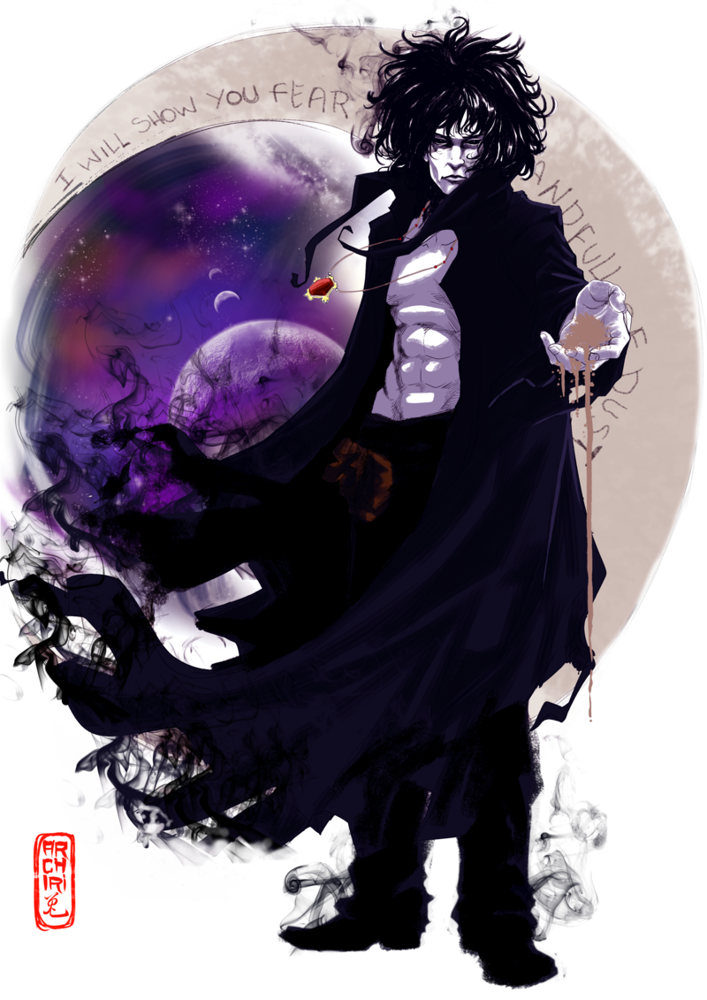

# Hi 👋! My name is Milan and I'm a developer from Serbia

)))  

# 💫 About Me:
🔭 I’m currently working on 
👯 I’m looking to collaborate on 
🤝 I’m looking for help with 
🌱 I’m currently learning 
💬 Ask me about 
⚡ Fun fact

## 🌐 Socials:
    

# 💻 Tech Stack:
                                                   
# 📊 GitHub Stats:
 
 

## 🏆 GitHub Trophies

### 🔝 Top Contributed Repo

---

 

<picture>
  <source media="(prefers-color-scheme: dark)" srcset="https://raw.githubusercontent.com/milan-micic/milan-micic/output/github-snake-dark.svg" />
  <source media="(prefers-color-scheme: light)" srcset="https://raw.githubusercontent.com/milan-micic/milan-micic/output/github-snake.svg" />
  
</picture>
