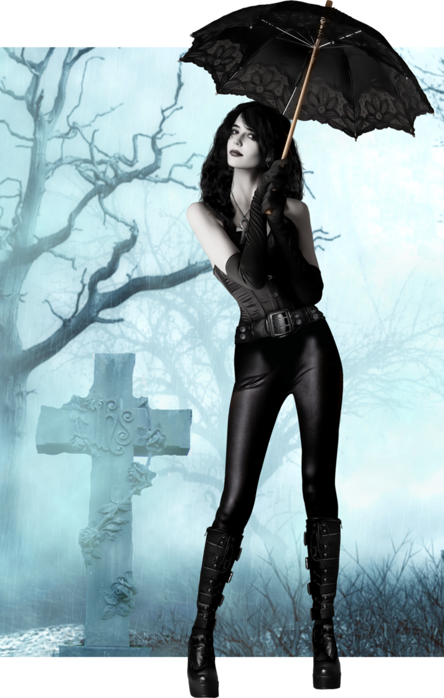

### Hi there, I'm Milan - aka Sandman  

)))  

## I'm a :video_game: Games, :movie_camera: Movies, :books: Books, and :notebook_with_decorative_cover: Comics :supervillain: Freak !!

- 🌱 I’m currently learning everything 🤣
- 👯 I’m looking to collaborate with other video-game porters
- 🔭 I’m looking to Contribute to Open Source projects
- 🥅 2021 Goals: full time web-dev jobs
- ⚡ Fun fact: I love to play guitar

---

### Spotify Playing 🎧

<!--  -->

---

  
:zap: GitHub Stats

  

    
 
   

*NOTE: Top languages does not indicate my skill level or something like that, it's a github metric of which languages i have the most code on github, it's a new feature of [github-readme-stats](https://github.com/anuraghazra/github-readme-stats)*

---